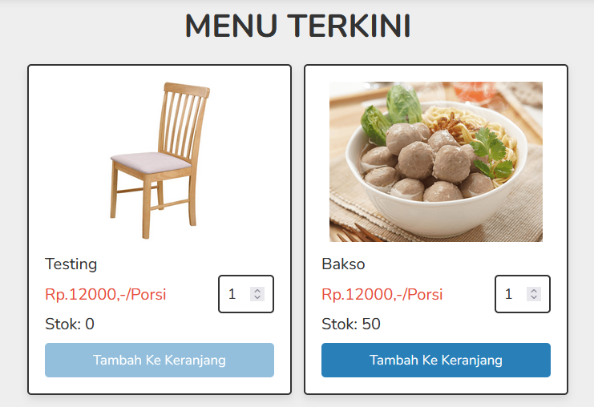
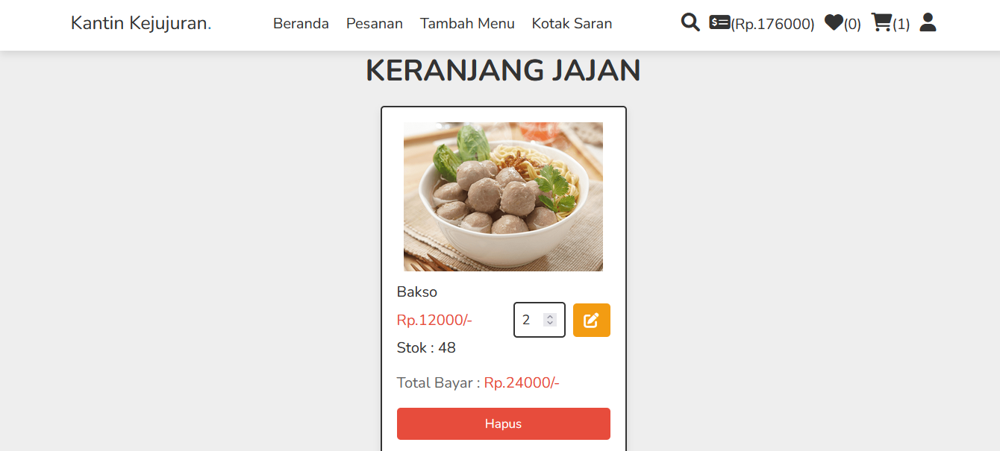
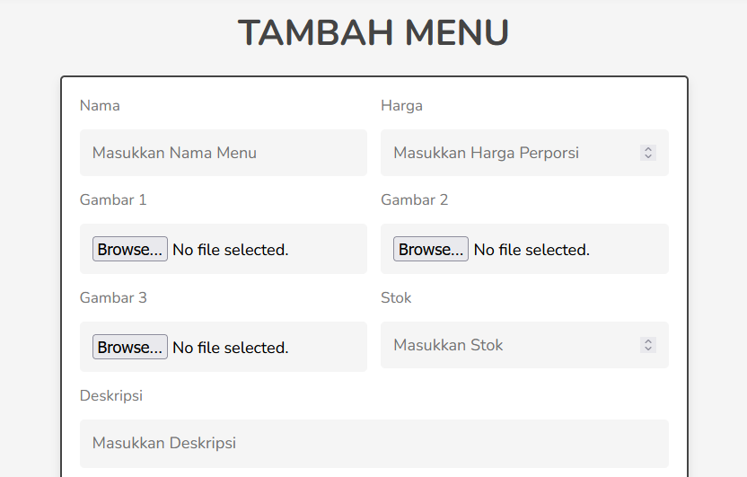
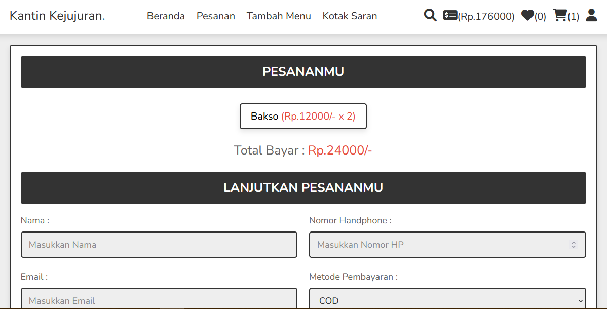
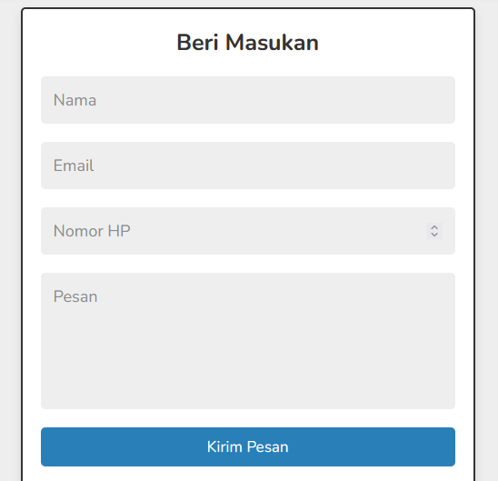

## Tentang Projek

Kantin kejujuran merupakan website yang dikembangkan menggunakan framework bootstrap. Website kantin kejujuran berbasis CRUD (Create, Read, Update dan Delete) dalam pengelolaan data menu.

## Kebutuhan Sistem
1. PHP 5.5.x
2. MySQL 5.5.x
3. Xampp 3.3.x

## Cara Penggunaan
- Clone project berikut dengan perintah `git clone https://github.com/ichwansh03/kantinQ.git`
- Buat database dengan nama `db_kantin`
- Import database `shop.db`
- Ubah `username` dan `password` pada file `konek.php` Sesuikan dengan user database anda

## Daftar Fitur
* Melihat menu saat ini. User juga dapat melihat secara detail menu dengan mengklik float button pada gambar dan menyipan pada wishlist
  

* Melihat pesanan. User dapat melihat pesanan yang telah ditambahkan untuk selanjutnya dilakukan checkout
  

* Menambahkan menu. User menambahkan menu untuk nantinya ditampilkan pada dashboard.
  

* Melakukan checkout. User membayar menu yang dibeli setelah dimasukkan ke wishlist

* Memberikan masukan. User dapat menulis komentar nya pada fitur kotak saran
  

## Kontributor

- Ichwan Sholihin : Project Lead
- Ichwan Sholihin : UI/UX Designer
- Ichwan Sholihin : Back-End Engineer
- Ichwan Sholihin : Front-End Engineer
- Ichwan Sholihin : QA Tester
